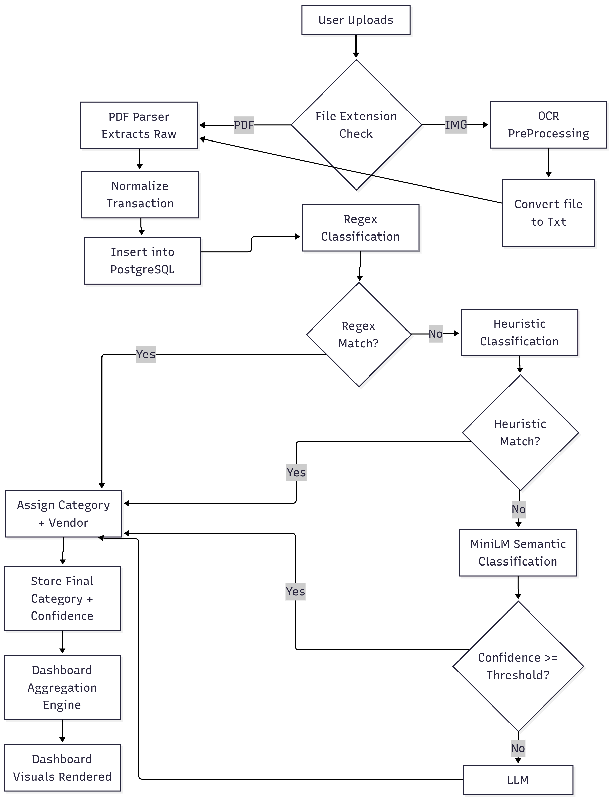

# SpendSight: Automated Financial Document Intelligence


SpendSight is an end-to-end, parallelized financial document processing system. It extracts, normalizes, and categorizes transactions from bank statements (PDFs) and scanned receipts using a robust pipeline of determinisitic rules, localized machine learning, and LLM fallbacks. The system is designed to provide secure, structured insights through a FastAPI backend and a scalable PostgreSQL database.

For complete technical specifications, see [specs.md](./specs.md).

---

## 🚀 Key Features



### 1. Unified, Parallel Parsing Pipeline

- **Multi-Bank Parsing**: Bank-specific extractors for BOB, PNB, SBI, IDBI, ICICI, and Federal Bank.
- **Generic OCR Parsing**: For unstructured image-derived PDFs.
- **Parallel Processing**: Employs `ProcessPoolExecutor` for bulk ingestion, handling multiple documents concurrently for maximum throughput.

### 2. Hybrid 4-Stage Classification Architecture

Our classification engine routes transactions sequentially, stopping as soon as high confidence is achieved:

1. **Regex Engine**: Lightning-fast deterministic rules for known recurring patterns.
2. **Heuristic Classifier**: Substring logic and intelligent keyword associations.
3. **MiniLM/BERT**: Semantic analysis model for understanding ambiguous transaction strings.
4. **LLM Fallback**: Batched processing via Gemini/LLM for complex edge cases.

### 3. OCR Microservice

- Ingests images and flattened PDFs.
- Uses Table Transformer and LaTr-style recognition for tabular data.
- Automates upload to blob storage (Supabase/Vercel) and triggers downstream processing.

### 4. Natural Language RAG Insights

- Uses vector embeddings (pgvector) over processed transactions to power natural language Q&A.
- "How much did I spend on food this month?"

---

## ⚙️ Installation & Setup

### 1. Clone the project

```bash
git clone https://github.com/yourrepo/spendsight.git
cd SpendSight
```

### 2. Virtual Environment & Dependencies

```bash
python3 -m venv venv
source venv/bin/activate
pip install -r requirements.txt
```

### 3. Environment Variables

Create a `.env` file at the root:

```env
DATABASE_URL=your_postgresql_connection_string
DEFAULT_USER_ID=your_uuid_for_user
UNIFIED_PIPELINE_MAX_WORKERS=4
SUPABASE_URL=...
SUPABASE_SERVICE_KEY=...
```

### 4. Database Setup

The app requires a PostgreSQL database. Execute the schema definitions against your DB:

```bash
psql $DATABASE_URL -f schema.sql
```

---

## 🔄 Using the Application

### Running the API Server

The core functionality is exposed via a FastAPI application.

```bash
uvicorn main:app --reload
```

- **POST `/documents/upload`**: Upload statement/receipt images or PDFs.
- **POST `/documents/{file_id}/parse`**: Enqueue the document into the Unified Pipeline.
- **GET `/transactions`**: Retrieve, filter, and inspect processed transactions.

### Running the Standalone Pipeline

To bulk-process all PDFs placed in `data/input/`:

```bash
python3 UnifiedPipeline.py
```

This script handles routing to specific parsers, pushes to DB, applies the 4-stage classifiers, and prints detailed metrics logs showing how many transactions fell through to the LLM stage.

### Running the OCR Service

```bash
cd ocr
python3 main.py
```

Runs a dedicated endpoint for computer vision processing of receipts/invoices.

---

## 🔐 Security & Architecture Let's

- **Per-User Isolation**: Database and logic restricts data queries tightly to `user_id` mapping.
- **Vector Isolation**: Document embeddings are strictly sandboxed per user ensuring no cross-contamination.
- **Data Extensibility**: Built entirely with relational models and structured logs (`classification_log`) to guarantee audibility of any predictive classification.

---
