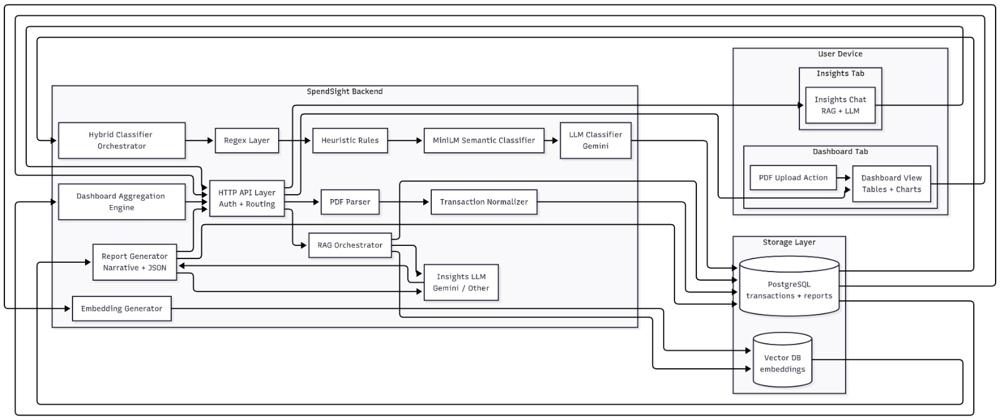
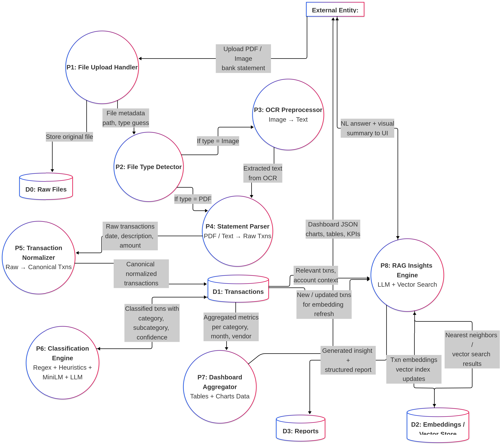

# SpendSight System Specifications

SpendSight is an automated financial document intelligence and processing system. It extracts, normalizes, classifies, and analyzes transactions from bank statements and receipts using a sophisticated multi-stage pipeline, and exposes these capabilities to users through a FastAPI backend and a scalable database architecture.

## 1. System Architecture



SpendSight is built modularly with parallel processing in mind. The system is divided into several main components:

1.  **Core API (`main.py`)**: A FastAPI application that handles HTTP requests for document uploads, statement processing, and transaction querying.
2.  **Unified Pipeline (`UnifiedPipeline.py`, `PipeLine.py`)**: The central processing engine that orchestrates parsing, normalization, and classification. It uses parallel processing `ProcessPoolExecutor` for handling multiple files concurrently.
3.  **Parsers (`parsers/`)**: Bank-specific PDF transaction extraction logic.
4.  **Classification Engine**: A 4-stage hybrid classification pipeline predicting vendor and categorization structure.
5.  **OCR Subsystem (`ocr/`)**: A dedicated service for extracting text from images and scanned PDFs.
6.  **RAG Insights (`rag/`)**: A vector-search and LLM-powered engine for querying transaction data in natural language.
7.  **Database**: A PostgreSQL database (typically hosted on Supabase) serving as the single source of truth.

---

## 2. Ingestion & Parsing Pipeline

The pipeline is triggered via the API (`/documents/{file_id}/parse`) or executed in bulk via `UnifiedPipeline.py`.

### 2.1 File Detection and Routing
-   The system reads the text of the first page of a PDF via `pdfplumber`.
-   It detects the bank by looking for specific keywords (e.g., "Bank of Baroda", "Punjab National Bank", "ICICI").
-   It routes the document to the corresponding parser in the `parsers/` directory:
    -   `bob.py` (Bank of Baroda)
    -   `pnb.py` (Punjab National Bank)
    -   `sbi.py` (State Bank of India)
    -   `federal.py` (Federal Bank)
    -   `idbi.py` (IDBI Bank)
    -   `icici.py` (ICICI Bank)
    -   `parse_ocr_generic.py` (for generic or OCR-derived documents)

### 2.2 Normalization
-   **Date Parsing**: Flexible date format interpretation (dd-mm-yyyy, yyyy-mm-dd, ddMonyyyy) returning a standard `datetime.date`.
-   **Amount Extraction**: Cleans numerical text and normalizes transaction direction (Withdrawal/Debit = Negative, Deposit/Credit = Positive).
-   Stores the base transaction temporarily to be inserted into the database.

---

## 3. Hybrid Classification Pipeline


Once transactions are inserted into the database, they undergo a sequential, 4-stage classification process. Transactions that reach a confident classification at any stage bypass the heavier subsequent stages.

1.  **Regex Engine (`regex_engine/`)**:
    *   Lightning-fast keyword and strict pattern-matching (e.g., `UPI/`, `NEFT/`).
    *   Determines basic categories and vendor names with high confidence for recurring, known patterns.
2.  **Heuristics Engine (`heuristics/`)**:
    *   Uses slightly looser fuzzy-matching, substring logic, and intelligent rules to categorize transactions missing strict regex formatting.
3.  **MiniLM / BERT (`nlp/`)**:
    *   A local semantic sentence-transformer model.
    *   For transactions marked 'PENDING' or classified with low confidence, this stage encodes the raw transaction description to determine the semantic proximity to known categories (`Taxonomy`).
4.  **LLM Fallback (`llm/`)**:
    *   Batched calls to an external Large Language Model (e.g., Gemini) for the toughest, ambiguous descriptions.
    *   Includes retry logic with exponential backoff.

Each transaction's classification journey is recorded in the `classification_log` table for auditing and pipeline metrics.

---

## 4. OCR Subsystem

The OCR module (`ocr/`) acts as a dedicated microservice.
-   **Input**: Images (JPG, PNG) or flattened PDFs.
-   **Processing**: Uses vision/OCR models (like LaTr or Table Transformer) to parse tabular data.
-   **Storage**: Connects with Vercel Blob or Supabase Storage for storing original visual files.
-   **Output**: Generates a normalized, machine-readable PDF or raw text that is passed back into the Unified Ingestion Pipeline.

---

## 5. RAG Insights Engine

Located in `rag/`, this module allows users to interact with their financial data through conversational queries.
-   Embeds transaction descriptions and periodic summaries.
-   Stores vectors in PostgreSQL using `pgvector` (`embeddings` table).
-   Performs semantic search to answer queries such as "How much did I spend on food this month?".

---

## 6. Data Schema & Data Flow



The database relies on PostgreSQL heavily utilizing UUIDs and constraints to separate user data securely.

*   `users`: Core user accounts (tenant isolation).
*   `documents`: Metadata on uploaded files, mapping a file to a user.
*   `statements`: Extracted metadata specific to bank statements (period dates, bank names).
*   `transactions`: The core table containing normalized transactions (amount, date, description, category, confidence).
*   `classification_log`: Audit trail for the 4-stage pipeline, storing predictions and confidence scores.
*   `ocr_docs`: Specific extracted text and properties from OCR processed files.
*   `embeddings`: Vector storage for the RAG engine mapping to users and transactions.
*   `reports`: Saved periodic summary analytics dashboards.

---

## 7. APIs Exposed (`main.py`)

*   `POST /documents/upload`: Accepts a PDF/Image, saves it to disk, and returns a tracking `file_id`.
*   `POST /documents/{file_id}/parse`: Adds raw document to the queue to undergo the `UnifiedPipeline` processing in the background.
*   `GET /documents/{file_id}/status`: Polls the database for document parsing state.
*   `POST /statements/{statement_id}/classify`: Re-triggers the MiniLM semantic classification explicitly.
*   `GET /transactions`: Query endpoint with advanced filtering parameters (date ranges, category, vendor, limits) returning formatted transaction arrays.

---

## 8. Directory Structure

```text
SpendSight/
├── main.py                     # API Gateway (FastAPI)
├── UnifiedPipeline.py          # Parallelized Ingestion Worker 
├── PipeLine.py                 # Core Processing Definitions
├── schema.sql                  # Database Schema definition
├── .env                        # Secrets and Variables
├── data/                       # Local data storage (input, output, reports)
├── parsers/                    # Bank-specific parsers
├── regex_engine/               # Stage 1: Regex Classification
├── heuristics/                 # Stage 2: Heuristics Classification
├── nlp/                        # Stage 3: MiniLM Classifier & Taxonomy
├── llm/                        # Stage 4: LLM fallback Classifier
├── ocr/                        # OCR Microservice logic
├── rag/                        # Embeddings & Query Interface
└── reports_dashboard.py        # Analytics visualization utilities
```
